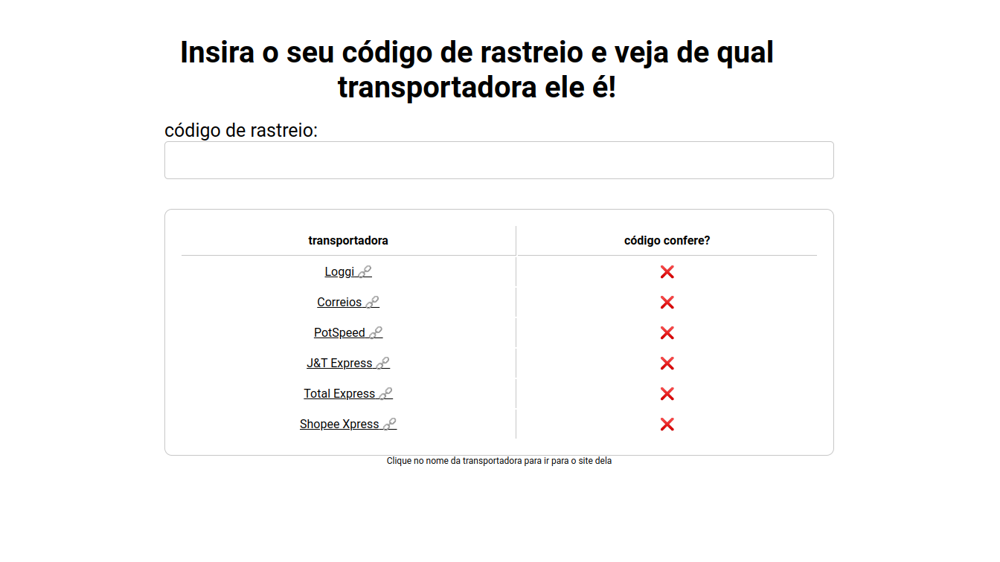

# Shopee entrega padrão



Este projeto tem como finalidade ajudar você a descobrir quais são as possíveis transportadoras para a sua entrega da Shopee.

## Como executar

### padrão

Para executar de forma convencional em sua máquina você precisará de:

* [nodejs](https://nodejs.org/en) versão `18.14.0`
* [pnpm](https://pnpm.io/)

Com tudo isso em mãos, execute:

```bash
pnpm install
```

e em seguida

```bash
pnpm dev
```

para executar a versão de desenvolvimento. Ou

```bash
pnpm build
pnpm start
```

para usar a versão de produção. 

Por fim basta acessar: `localhost:3000` e pronto :)

---

### docker

Para usar a versão de produção já compilada com docker, rode:

```bash
docker run -d -p 3000:3000 dpbm32/shopee-entrega-padrao
```

ou se preferir pode usar o `docker compose`:

```bash
docker-compose up -d
```

após isso, para acessar basta ir para `<docker_ip>:3000`, caso você não saiba o `docker_ip`:

1. com o container rodando, execute `docker ps` e pegue o `Container ID`;
2. execute: `docker inspect <container_id> | grep IPAddress`.

## Testes

Os testes foram feitos utilizando o `cypress`, para vê-los de forma gráfica em um browser rode

```bash
pnpm cypress:open
```

ou para rodá-los no terminal `headless`, use:

```bash
pnpm cypress:run
```

contudo, este ultimo necessita de um instancia rodando do sistema em `localhost:3000`, para solucionar isso use:

```bash
pnpm test
```

## Contribuir

Existem diversas maneiras para contribuir com esse projeto, aqui estão algumas:

1. resolver bugs
2. resolver typos
3. adicionar mais transportadoras
4. ajudar a melhorar o site

se você tem alguma ideia de como ajudar, não seja tímido, abra uma `ISSUE` ou ainda crie um `PULL REQUEST`. Sua ajuda é sempre bem-vinda :)